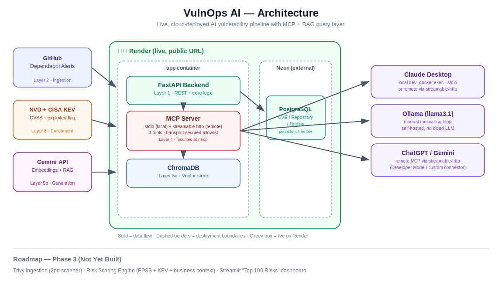

# VulnOps AI

A live, AI-powered vulnerability management platform that ingests findings from two real scanners (GitHub Dependabot + Trivy), enriches them with NVD, CISA KEV, and FIRST.org EPSS threat intelligence, computes a weighted business-risk score per finding, and lets you query the result in plain English via MCP tools and RAG.

**Live demo:** `https://vulnops-ai.onrender.com` *(free-tier hosting — first request after idle may take ~30-60s to cold-start)*

## The Problem This Solves

Most vulnerability scanners are excellent at finding problems and terrible at telling you which ones matter. A single container image scan can easily surface 150+ findings; a real org running Dependabot, Trivy, and cloud scanners across many repos generates far more than any team can triage by hand. Sorting by CVSS score alone is a weak strategy — CVSS measures theoretical severity, not real-world exploitation likelihood, and (as this project's own data shows) different tools sometimes disagree on both.

The actual question a CISO asks is not "how many vulnerabilities do we have" — it's:

> "Out of everything, what are my top risks, and why?"

VulnOps AI ingests real findings from two structurally different scanners, enriches them with three independent threat-intel sources, computes a defensible weighted risk score, and lets both humans and AI assistants query the result conversationally, with sources cited.

## Architecture



| Layer | What it does | Tech |
|---|---|---|
| 1. Data | CVE/Repository/Finding schema, source-tagged | FastAPI, SQLAlchemy, PostgreSQL (Neon) |
| 2. Ingestion | Two scanners into one schema | GitHub Dependabot API, Trivy (container image scan) |
| 3. Enrichment | CVSS, exploited-in-the-wild flag, exploitation probability | NVD API, CISA KEV feed, FIRST.org EPSS API |
| 4. Tool exposure | Vulnerability queries as AI-callable tools | MCP — both `stdio` and `streamable-http` |
| 5. Semantic search | Answers open-ended questions | ChromaDB + Gemini API (RAG) |
| 6. Risk scoring | Weighted business-risk ranking | Custom Python scoring engine |

Deployed on **Render** (app) + **Neon** (persistent Postgres), both free tier.

## Risk Scoring Engine

```
Risk Score = 30% Business Criticality
           + 25% EPSS (exploitation probability)
           + 20% KEV (confirmed active exploitation)
           + 15% Internet Exposure
           + 10% Compensating Controls (inverted — more controls lowers risk)
```

Exposed at `GET /risk/top?limit=N` — returns findings across **both** scanners, ranked by computed score, not raw CVSS.

An honest breakdown of where each input actually comes from:

| Factor | Weight | Source | Automatable? |
|---|---|---|---|
| EPSS | 25% | FIRST.org EPSS API | Yes — real, live data |
| KEV | 20% | CISA KEV feed | Yes — real, live data |
| Business Criticality | 30% | Manually tagged per repository | No — organizational context |
| Internet Exposure | 15% | Manually tagged per repository | No — organizational context |
| Compensating Controls | 10% | Manually tagged per repository | No — inherently a judgment call |

This mirrors reality: most enterprise RBVM platforms automate the threat-intelligence half and rely on manually maintained asset context for the rest. Modeling that honestly is part of the design.

## Real Data Quality Findings (Not Bugs — Discoveries)

Building this surfaced genuine data-integrity issues worth documenting, since a mature security tool should surface these rather than hide them:

- **CVSS vs. severity label divergence**: `CVE-2018-20796` is labeled "LOW" severity by its source but carries an NVD CVSS score of 7.5 (HIGH range) — the two fields are tracked separately because they can and do disagree.
- **NVD scoring lag**: some very recent CVEs (e.g., `CVE-2026-53615`) have no NVD CVSS score yet, while vendor-specific advisories (Amazon Linux ALAS, Tenable) had already scored them. NVD is treated as the single CVSS source in this build; a production system would add vendor advisories as a fallback.
- **Pre-CVSSv3 CVEs**: several Trivy-surfaced base-OS CVEs date to 2005-2010, predating CVSS v3 entirely. The NVD client falls back to CVSS v2 for these rather than reporting them as unscored.
- **Unscored ≠ zero risk**: CVEs with no score anywhere are represented as unknown, not defaulted to 0 — treating "not yet analyzed" the same as "confirmed low severity" would be a real prioritization mistake.

## MCP Tools

- `get_open_findings()` — all unpatched findings across both scanners
- `get_kev_findings()` — open findings actively exploited in the wild (CISA KEV)
- `ask_vulnerability_question(question)` — RAG-powered semantic search over all 82 tracked CVEs

## Three Ways to Query It

1. **REST API** — plain HTTP, e.g. `POST /ask`, `GET /risk/top`
2. **Claude Desktop (MCP, `stdio`)** — local, via `docker exec`
3. **Remote MCP (`streamable-http`)** — mounted at `/mcp` on the live Render deployment, secured with an explicit host allowlist (DNS-rebinding protection kept on, not disabled); compatible with ChatGPT Developer Mode, Claude remote integrations, and the project's own `ollama_chat.py` manual tool-calling loop

## Tech Stack

FastAPI · SQLAlchemy · PostgreSQL (Neon) · Docker · ChromaDB · Google Gemini API · MCP (stdio + streamable-http) · Ollama (llama3.1) · GitHub Dependabot API · Trivy · NVD API · CISA KEV feed · FIRST.org EPSS API · Render

## Security Practices Applied

- Secrets in `.env` / Render environment variables, never committed
- GitHub token scoped read-only, single-repo (least privilege)
- MCP transport secured with an explicit host/origin allowlist
- Rate-limit-aware external API calls with pacing and error handling

## Known Limitations (Honest Disclosure)

- No authentication on REST endpoints — acceptable for a portfolio demo, not for real use
- Render free tier has no persistent disk; ChromaDB rebuilds via `/sync/embed` on each redeploy
- CVSS scoring relies solely on NVD, which can lag vendor-specific advisories for very recent CVEs
- Business Criticality, Internet Exposure, and Compensating Controls are currently manually-tagged defaults per repository, not yet a real per-asset tagging UI

## Roadmap

- **Streamlit dashboard** — a "Top 100 Risks" view over `/risk/top`, with AI-generated plain-English explanations per finding
- Vendor-advisory fallback (ALAS, Tenable) for CVEs NVD hasn't scored yet
- Per-finding manual tagging UI for business criticality / exposure / controls, replacing per-repository defaults

## Running Locally

```bash
git clone https://github.com/cybersham/vulnops-ai.git
cd vulnops-ai
cp .env.example .env
docker compose up --build

curl -X POST http://127.0.0.1:8000/sync/dependabot
curl -X POST http://127.0.0.1:8000/sync/trivy -F "file=@trivy_results.json"
curl -X POST http://127.0.0.1:8000/sync/enrich
curl -X POST http://127.0.0.1:8000/sync/epss
curl -X POST http://127.0.0.1:8000/sync/embed
curl "http://127.0.0.1:8000/risk/top?limit=20"
```

---

Built by [Shameem Banu](https://github.com/cybersham) — Senior DevSecOps & Cybersecurity Engineer transitioning into AI-native security tooling.
